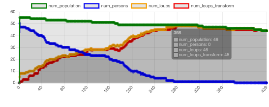

# TP1 Qingchen YANG 
## Question 1

 J'ai écrit le code suivant : pour chaque loup-garou, construisons d'abord une fonction qui peut renvoyer la liste des personnes actuellement à sa portée d'attaque. Pour les villageois de la liste, changez directement sa valeur bool qui définit s'il est loup-garou en true. 
 C'est compatible avec la définition d’agent qu'on a vue en cours. 
Selon le cours, on sait que "Un agent est capable de percevoir l'environnement et d’agir dessus, il peut communiquer avec d’autres agents, il exhibe un comportement autonome." Ici un agent loup-garou peut changer l'état d'un agent villageois, qui est l'incarnation de l'interaction entre les agents.

```{python}

def list_near_agents(self, agents, distance):  
    list_near_agents = []  
    for obj in agents:  
        if np.square(obj.pos[0] - self.pos[0]) + np.square(obj.pos[1] - self.pos[1]) < np.square(distance):  
            list_near_agents.append(obj)  
    return list_near_agents

if self.loup:  
    list_near_agents = self.list_near_agents(self.model.schedule.agents, self.distance_attack)  
    for obj in list_near_agents:  
        obj.loup = True
```


## Question 2
Le système convergera dans la direction où il n'y a pas de villageois ordinaires et tous deviennent des loups-garous. Il commence à se stabiliser après environ 250 cycles et il n'y a que des loups-garous après environ 400 cycles.

L'augmentation du nombre initial de loups-garous accélérera la vitesse de la convergence ci-dessus.

Si le nombre de  l'apothicaires est assez grand, plus de loups-garous peuvent être guéris avant qu'ils se transforment, mais si le nombre de apothicaires est petit, comme dans cette question, les apothicaires seront impuissants contre un grand nombre de loups-garous, et les loups-garous deviendront bientôt transformé, auquel cas les apothicaires ne pourront que ralentir le virus mais pas s'arrêter.

La présence de chasseurs peut tuer les loups-garous transformés, ralentissant ainsi l'infection et réduisant le nombre de loups-garous qui se retrouvent dans le système final. Si le nombre de chasseurs est extrêmement important, les loups-garous transformés seront rapidement découverts et tués par de nombreux chasseurs, le résultat final peut être que  les villageois existent toujours et les loups-garous sont disparus. 

## Question 3



Les résultats étaient conformes aux prédictions, le nombre de loups-garous a augmenté rapidement et finalement tous les humains sont devenus des loups-garous.


## Question 4

Nous avons utilisé une valeur d'apothicaires très élevée : 20, et constaté que même si cela ne change toujours pas le fait que tous les humains finiront par devenir des loups-garous, cela peut effectivement ralentir cette convergence.
Des valeurs aussi élevées sont encore loin d'être suffisantes pour faire face à cette éventuelle tendance car elles ne peuvent faire rien contre les loups-garous transformé.Voici le résultat.


Nous fixons le nombre de chasseurs à 20, un nombre extrême très grand, les loups-garous transformés seront rapidement découverts et tués par de nombreux chasseurs, ce qui freine grandement la propagation et change même le résultat.Le résultat final est que les villageois existent toujours et les loups-garous sont disparus. Voici le résultat.


## Question 5
La probabilité de l'attaque et l'étendue de l'attaque peuvent également changer considérablement le cours des choses. Plus la probabilité d'une attaque de loup-garou est petite, ou plus la portée d'attaque du loup-garou est petite, ou plus la portée d'attaque du chasseur est grande, ou plus la portée de guérison des apothicaires est grande, plus la tendance pour tous les personnes à devenir un loup-garou est lente.
## Question 6
Si la valeur d'apothicaires très élevée, alors on peut effectivement ralentir la convergence, mais le nombre 6 n'est pas suffisants pour changer cette éventuelle tendance car les apothicaires ne peuvent faire rien contre les loups-garous transformé. Le contamination et la transformation est trop rapide pour seulement 6 apothicaires.
## Question 7
résultat:
| num_clerics |  num_population  |  num_persons  | num_loups  | num_loups_transform |
|  ----  |  ----  |  ----  | ----  | ----  |
|  0  |  39 | 39 | 39 | 39 |
|  1  |  32 | 32 | 32 | 32 |
|  2  |  44 | 44 | 44 | 44 |
|  3  |  48 | 48 | 48 | 48 |
|  4  |  33 | 33 | 33 | 33 |
|  5  |  42 | 42 | 42 | 42 |
|  6  |  38 | 38 | 38 | 38 |

Nous avons constaté que la modification du nombre de apothicaires avait peu d'effet sur les résultats, probablement parce que les nombres de apothicaires testés étaient trop petits.

## Question Bonus
Dans ce cas, une grande quantité de données doit être testée, ce qui nécessite beaucoup de temps d'exécution et de puissance de calcul, et consomme beaucoup de temps. Donc on peut utiliser :
```
batchrunner.BatchRunnerMP(model_cls, nr_processes=2, **kwargs)
```
C'est un child-class de BatchRunner, étendue avec la prise en charge du multiprocessing, ainsi, il peut réduire le temps de fonctionnement.