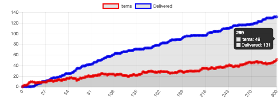
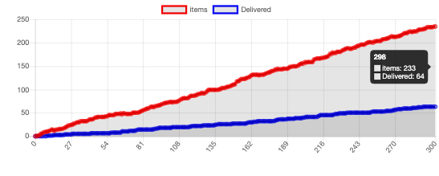
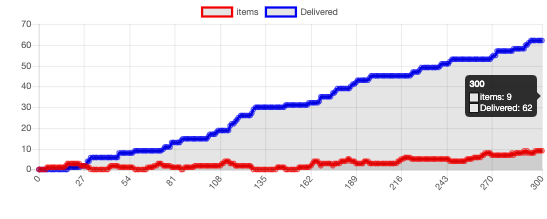
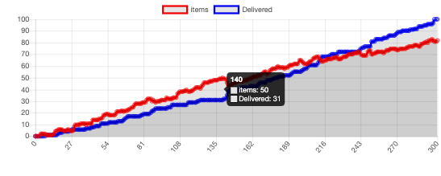
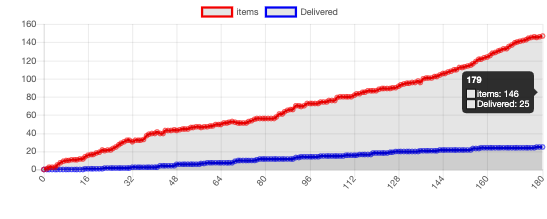
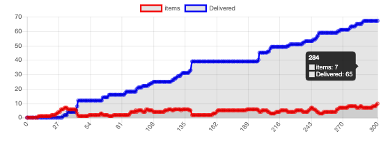

# TP2 Qingchen YANG & Yanan CHEN
## Question 1

- ▶  accessible aux agents: des vaisseaux, des planètes
- ▶  déterministe: Les fonctions des vaisseaux, des planètes sont spécifiques
- ▶  non-épisodique: Il ne revient pas à l'état de départ
- ▶  statique: Seuls les agents peuvent le changer,  l'environnement ne peut pas se changer automatiquement.
- ▶  continu: Les coordonnées et le mouvement sont tous continus

## Question 2

Items ne peuvent pas s'interagir et ne peuvent être déplacés qu'à l'aide d'agents ( les vaisseaux et les planètes ), ce n'est donc pas un agent.

## Question 3

Avec les paramètres par défaut, il y a 15 vaisseaux et 10 planètes, la croissance du nombre de biens livrés est beaucoup plus rapide que celle du nombre de biens présents, ce qui signifie que les items peuvent être transportés dans le temps et que la croissance du nombre de biens présents n'est pas rapide.

Si le nombre de planètes est trop grand par rapport au nombre de vaisseaux, alors on n'aura pas assez de vaisseaux pour transporter les items, ils s'accumuleront, le nombre de biens présents dans le système augmentera très rapidement, le nombre de biens livrés croît lentement, beaucoup moins que le nombre de biens présents dans le système. Comme indiqué ci-dessous, lorsqu'il y a 3 vaisseaux et 20 planètes:

Si le nombre de vaisseaux est bien supérieur au nombre de planètes, c'est l'inverse, dès qu'il y a un item à expédier, il sera expédié rapidement, le nombre de biens présents dans le système a été maintenu à un niveau inférieur, comme indiqué dans la figure ci-dessous (20 vaisseaux et 3 planètes):

## Question 4

C'est l'organisation coopérative: ils recherchent d’efficacité

Les vaisseaux et les planètes coopèrent l'un avec l'autre, seulement pour mieux effectuer la livraison.

## Question 5

C'est dynamique maintenant, pas statique, parce que l'environnement peut changer même sans l'intervention d'un agent.

## Question 6
Adaptabilité: Lorsqu'une route n'est pas disponible, les vaisseaux et les planètes ignorent temporairement cette route. De plus, le vaisseau ajustera sa vitesse en fonction de la situation de congestion
## Question 7
15 vaisseaux et 10 planètes：Le transport est moins efficace qu'avant en raison de la congestion.

3 vaisseaux et 20 planètes: Le transport est moins efficace qu'avant en raison de la congestion, même s'il n'y a que 3 vaisseaux.

20 vaisseaux et 3 planètes: En général, pas beaucoup d'influence dans ce cas

