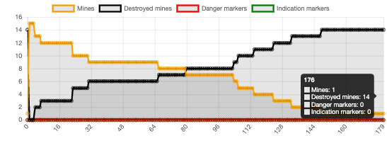
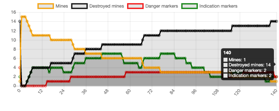
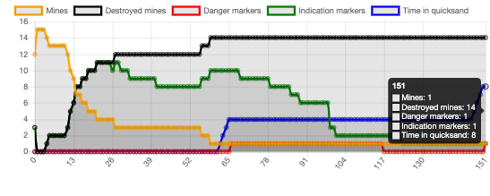
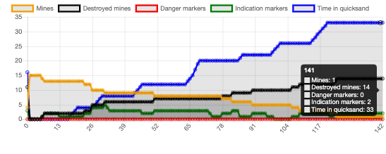

# TP3 Qingchen YANG 
## Question 1

Subsomption me paraît la plus à même de traiter ce problème. Selon le cours, Subsomption a:

- une architecture par niveau
-  comportement de niveau bas ↔ priorité haute
-  peu (idéalement pas) d’interaction entre les 
- comportements pas d’état interne
-  pas de communication (directe) entre agents 
- comportements simples

Ici, il existe différents niveaux d'importance pour les comportements du robot, par exemple, éviter les collisions avec d'autres robots ou obstacles est le plus important. De plus, il n'y a pas de communication directe entre robots.

## Question 2
niveau 0: Éviter un autre robot et Éviter un obstacle / les bords de l’environnement

niveau 1: Se diriger vers une mine quand une mine est trouvée

niveau 2: Se déplacer quand aucune mine n'est trouvée

Détruire une mine peut être effectué avant de prendre une décision sur la direction de la prochaine étape, donc nous ne le considérons pas dans ces niveaux.

Avec les paramètres par défaut dans le code d'origine :

| num_lancer |  num_steps  |
|  ----  |  ----  |
|  1  | 180 |
|  2  | 298 |
|  3  |  203 |
|  4  | 316 |
|  5  |  148 |
|  6  |  352 |
|  7  |  172 |
|  8  | 243 |
|  9  | 216 |
|  10  |  211 |

Le temps moyen de désamorçage de toutes les mines: 233.9 steps.

## Question 3

 Les principes suivantes des agents réactifs sont ici respectés:

Modularité : 1 tâche → 1module/comportement

Pas de modèle : Données brutes issues des senseurs

manipuler: destroy les mines

explorer: chercher les mines

éviter collision: avec les autres robots, les contraintes, les obstacles

Lesquels ne le sont pas:

Simplicité : Perception → action (communication). Il n'y a pas de communication entre les robots

cartographier: il n'y a pas encore de masker

## Question 4

Maintenant on a la communication indirecte entre les robots donc le critère suivant est vérifié:

Simplicité : Perception → action (communication).

## Question 5

niveau 0: Éviter un autre robot et Éviter un obstacle / les bords de l’environnement

niveau 1: Se diriger vers une mine quand une mine est trouvée

niveau 2: Se diriger selon l'indication d'une balise quand on se trouve à cette balise

niveau 3: Se diriger vers une balise quand une balise est trouvée

niveau 4: Se déplacer quand aucune mine n'est trouvée

Détruire une mine, placer ou retirer une balise est une action qui peut être fait lorsque le robot est déjà à une mine/balise, ces actions peuvent être effectuées avant de prendre une décision sur la direction de la prochaine étape, donc nous ne les considérons pas dans ces niveaux.

Justifier: ajouter de nouveaux niveaux 2 et 3, 1 est avant 2 et 3 parce que quelle que soit l'état de la balise, donnez toujours la priorité à la recherche de mines et dirigez-vous vers elles pour éliminer toutes les mines le plus rapidement possible.

## Question 6

| num_lancer |  num_steps  |
|  ----  |  ----  |
|  1  | 140 |
|  2  |  202 |
|  3  | 155 |
|  4  | 267 |
|  5  |  169 |
|  6  | 293 |
|  7  | 143 |
|  8  | 190 |
|  9  | 173 |
|  10  | 206 |

Le temps moyen de désamorçage de toutes les mines: 193.8 steps < 233.9 steps en question 2.

En utilisant la balise, nous réalisons la communication indirecte, qui nous permet de prendre de meilleures décisions face aux sables mouvants et aux mines déjà déminées, augmentant ainsi la vitesse de déminage.

## Question 7

Nous observons des paires d'expériences dont les nombres des étapes sont similaires dans deux cas. Par exemple, comme le montre les figures, lorsqu'il n'y a pas de balise DANGER, lorsque les mines sont déminées en 141 étapes, time_quicksand = 33, et lorsqu'il y a la balise DANGER, lorsque les mines sont déminées en 151 étapes, time_quicksand=8. Après avoir répété plusieurs fois des expériences similaires, je pense que les résultats montrent que l'utilisation de DANGER peut réduire le temps_quicksand

