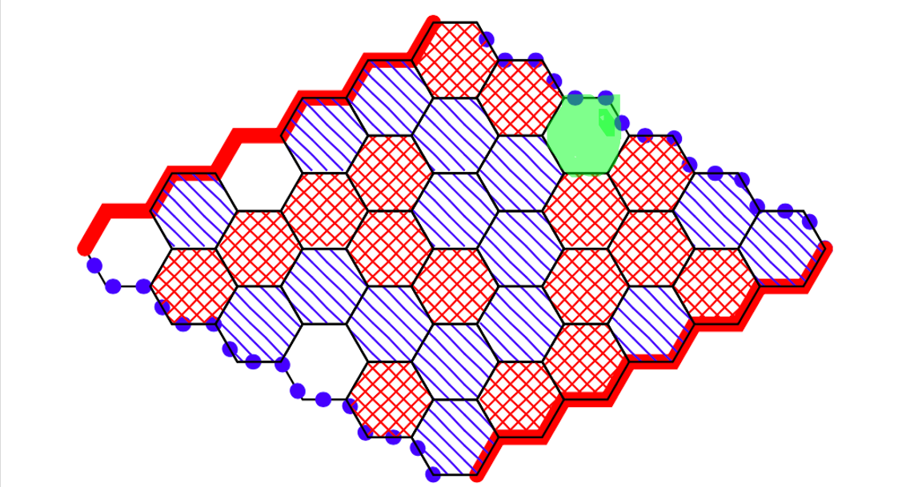
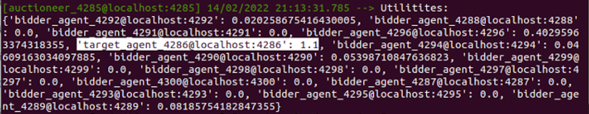
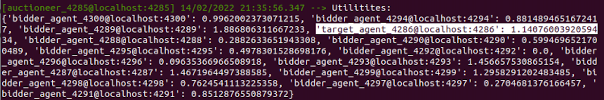

# TP5 Qingchen YANG 
## Question 1

Le but de chaque joueur est de relier les contraires correspondant à sa couleur, donc l'agent rouge joue à l'espace verte pour gagner.

## Question 2

L’agent souhaite avoir un coût et un temps de trajet aussi faibles que possible. Nous nous inspirons de log loss function et utilisons le moins log du temps et du coût. Dans le premier cas, nous ne considérons pas les poids des deux, et dans le second cas, nous attribuons des poids différents aux deux termes, en considérant que le coût et le temps ne sont pas aussi importants.

Ici, i est l'index des chemins parcourus, n est le nombre total des chemins parcourus. wc et wt sont les poids du coût et du temps. Pour minimiser le coût et le temps, on peut chercher à maximiser utility ici.
$$
utility_1 = \sum^n_{i=0}-log(c_i) - log(\delta t_i)
\\
utility_2 = \sum^n_{i=0}-w_c * log(c_i) - w_t * log(\delta t_i)
$$

## Question 3

En supposant que la rationalité des agents s’exprime comme l’espérance de l’utilité, alors 
$$
E(A_1) = 10000
\\
E(A_2) = 15000*0.9 = 13500
\\
E(B_1) = 10000*0.1 = 1000
\\
E(B_2) = 15000*0.09=1350
$$
En choisissant entre A1 et A2, les gens choisissent l'espérance(utilité) la plus basse, qui est irrationnelle, et en choisissant entre B1 et B2, les gens choisissent l'espérance(utilité) la plus élevée, qui est rationnelle.

Comme l'agent n’est pas forcément égale à l’argent qu’il reçoit, donc ici pour les gens, une utilité plus appropriée dans l'expérience est probablement "la probabilité d'obtenir de l'argent". Dans l'expérience 1, les gens ont une probabilité de 100% d'obtenir de l'argen pour A1, tandis que A2 n'est que de 90%, de plus, en A1, les gens recevront certainement de l'argent. Dans l'expérience deux, B1 et B2 ont respectivement une probabilité de 10% et 9% d'obtenir de l'argent, la différence est très faible, à ce moment-là, les gens prendront en compte la différence entre les montants des bonus de B1 et B2 et choisiront le bonus le plus élevé.

## Question 4

L'utilité de l'agent peut être écrite comme son estimation du bien moins le prix qu’il parie, il peut donc essayer de réduire le prix qu’il parie, mais ça ne peut pas être "trop petit", car l'agent veut gagner l'enchère en tout cas. Ici l'agent pense qu'un autre agent propose peu probablement un prix supérieur à 80$, il peut donc choisir un chiffre entre 80 $ et 100 $, après avoir pris en compte la probabilité que les adversaires enchérissent plus que chaque valeur.

## Question 5

Montrer (par l’absurde) que l’agent n’a pas intérêt à enchérir au-dessous de son estimation:

Si l'agent A enchérit au-dessous de son estimation pour un bien C et l'agent B enchérit plus que A.

 Supposont que pour l'agent A et B, la formule de l'utilité est la même, alors l'estimation de C par A et par B tous sont E(C).

Notons Ea, Eb l'enchère de l'agent A, B pour C. Alors on a Ea < E(C) < Eb ou Ea < Eb <= E(C), mais le résultat est tourjour que B gagne et paye l'argent proposé par A, donc l’agent n’a pas intérêt à enchérir au-dessous de son estimation dans l’enchère de Vickrey.

## Question 6

Nous avons reussi à terminer le code et pouvons voir les différents types de messages ajoutés. Les bidders sont en mesure de traiter diverses informations de l'auctioneer(CFP, accept, reject). De plus, l'utilité de l'agent est affichée avec succès à la fin de la simulation.

Le target agent parie un peu moins (ici 0.1) que son utilité ́/son budget restant. On voit que, dans le cas de l'enchère scellée au premier prix, les résultats ci-dessous que l'utilité de l'agent target est beaucoup plus grande que les autres agents à la fin (l'utilité du target agent est 1.1, l'utilité des autres agents n'est pas supérieure à 0,4 et 9 des 14 autres agents a une utilité de 0).

## Question 7

Dans l'Enchère de Vickrey, le TargetAgent n'obtient plus forcément l'utilité maximale, et l'utilité de chaque agent est comparable. L'écart entre tous les utilités n'est pas aussi grand que dans la question précédente, ce qui montre la question 5.

